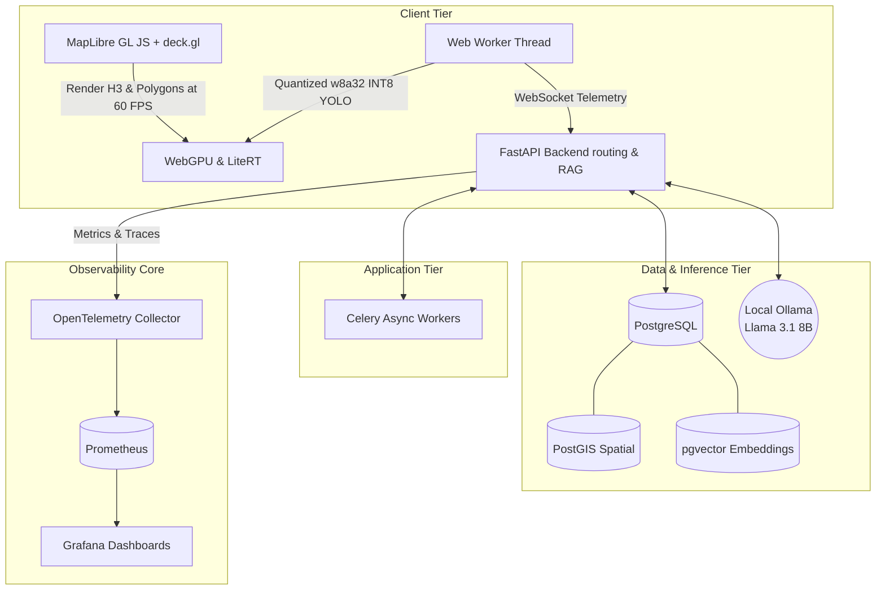

# CropPilot

> **Intelligent Agri-Command Center | Edge-Hybrid FOSS MVP**

CropPilot is a 100% free, local-first, open-source Precision Agriculture platform designed for maximum data sovereignty and extreme low-latency telemetry processing. Powered by a mesh of modern WebGL mapping, semantic vector search, and local on-device Large Language Models (LLMs), CropPilot represents the cutting edge of decentralized farming intelligence.

## Technical Value Proposition: Local-First Sovereignty

In an industry plagued by expensive API subscriptions and cloud lock-in, CropPilot proves that enterprise-grade capabilities can run completely offline, locally, on consumer hardware. 
* **Zero API Tokens**: Uses OpenStreetMap and MapLibre GL JS instead of commercial mapping services.
* **Unified FOSS Database**: Consolidated into PostgreSQL, utilizing PostGIS for lightning-fast H3 spatial queries and pgvector for embedding storage.
* **Local AI Sovereignty**: No OpenAI or Anthropic calls. Everything runs locally on an Ollama Llama 3.1 8B instance accelerated on your local GPU.
* **Open Government Data**: Automatically ingests daily scheme updates from PM-KISAN and live market rates from Agmarknet.

## Detailed Architecture Overview

The system architecture is broken down into four primary tiers that operate entirely locally to provide a highly cohesive, edge-hybrid mesh.

### 1. Client Tier
The client is a Next.js application that leverages MapLibre GL JS and deck.gl for WebGL-accelerated rendering. It handles spatial visualization, rendering H3 hexagons and boundary polygons at 60 FPS. It also implements WebGPU via LiteRT for in-browser quantization of models like YOLO for rapid visual disease detection. It communicates with the backend via WebSocket for real-time telemetry streaming.

### 2. Application Tier
The core application tier is built with FastAPI in Python. It handles REST routing, spatial RAG (Retrieval-Augmented Generation) query processing, and interfaces with the machine learning components. It uses Celery for asynchronous background task processing, such as periodically ingesting market rates or updating weather models.

### 3. Data and Inference Tier
All persistent state is stored in a single unified PostgreSQL container. This database leverages the PostGIS extension for complex geospatial queries and the pgvector extension for high-dimensional semantic search and RAG embeddings. AI inference is entirely offloaded to a local Ollama container running the Llama 3.1 8B model natively, utilizing the local NVIDIA GPU for hardware acceleration.

### 4. Observability Core
An enterprise-grade telemetry pipeline tracks the entire system. FastAPI application metrics are intercepted and sent to an OpenTelemetry Collector, which then forwards the data to a Prometheus time-series database. Grafana is configured with provisioning files to automatically load dashboards visualizing API request rates, latency distributions, and database connection pool states.

## System Architecture Topology



## Local Hardware Prerequisites

CropPilot has been extensively optimized to run a full LLM and telemetry stack simultaneously on consumer gaming hardware.
* **GPU**: NVIDIA RTX 4060 (8GB VRAM minimum for quantized Llama 3.1).
* **Memory**: 32GB RAM (Required to share load between PostgreSQL shared buffers, system memory, and Docker overhead).
* **OS**: Windows (WSL2), Linux, or macOS.

## Quick Start Setup Guide

Follow these steps to deploy the entire Edge-Hybrid stack locally with zero cost.

### 1. NVIDIA Container Toolkit Setup
Ensure you have Docker Desktop installed and running. If you are on Linux or WSL2, install the NVIDIA Container Toolkit to pass your RTX 4060 through to the Ollama container.

### 2. Boot the Infrastructure Mesh
Spin up the unified PostgreSQL database, Celery workers, API, and the Observability Core:
```bash
docker-compose up -d --build
```

### 3. Pull the Local LLM Model
Execute into the Ollama container and pull the Llama 3.1 8B model into local VRAM:
```bash
docker exec -it croppilot-main-ollama-1 ollama run llama3.1:8b
```

### 4. Launch the Frontend Application
In a separate terminal, install the dependencies and boot the Next.js development server:
```bash
cd frontend
npm install
npm run dev
```

### 5. Start the Telemetry Simulator
To generate live traffic for Grafana metrics, run the Node.js traffic simulator from the project root:
```bash
node scripts/simulate_traffic.js
```

Visit `http://localhost:3000` to access the Agri-Command Center, and `http://localhost:3001` (if mapped) to view the Grafana observability panels!

## Live Production Demo

| Frontend Dashboard (MapLibre + deck.gl) | Grafana Telemetry Metrics | Local Ollama Inference |
|:---:|:---:|:---:|
|  |  |  |
