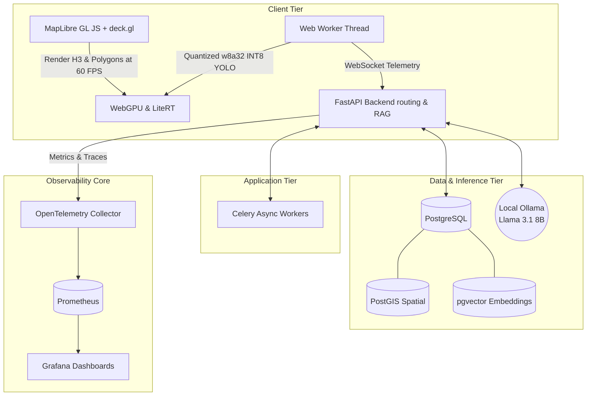

# CropPilot 🚁🌾

> **Intelligent Agri-Command Center | Edge-Hybrid FOSS MVP**

CropPilot is a 100% free, local-first, open-source Precision Agriculture platform designed for maximum data sovereignty and extreme low-latency telemetry processing. Powered by a mesh of modern WebGL mapping, semantic vector search, and local on-device Large Language Models (LLMs), CropPilot represents the cutting edge of decentralized farming intelligence.

---

## 🌟 Technical Value Proposition: Local-First Sovereignty

In an industry plagued by expensive API subscriptions and cloud lock-in, CropPilot proves that enterprise-grade capabilities can run completely offline, locally, on consumer hardware. 
- **Zero API Tokens**: Uses OpenStreetMap and MapLibre GL JS instead of commercial mapping services.
- **Unified FOSS Database**: Consolidated into PostgreSQL, utilizing PostGIS for lightning-fast H3 spatial queries and `pgvector` for embedding storage.
- **Local AI Sovereignty**: No OpenAI or Anthropic calls. Everything runs locally on an Ollama Llama 3.1 8B instance accelerated on your local GPU.
- **Open Government Data**: Automatically ingests daily scheme updates from PM-KISAN and live market rates from Agmarknet.

---

## 📸 Live Production Demo

| Frontend Dashboard (MapLibre + deck.gl) | Grafana Telemetry Metrics | Local Ollama Inference |
|:---:|:---:|:---:|
|  |  |  |

---

## 🏗️ System Architecture Topology



---

## 💻 Local Hardware Prerequisites

CropPilot has been extensively optimized to run a full LLM and telemetry stack simultaneously on consumer gaming hardware.
- **GPU**: NVIDIA RTX 4060 (8GB VRAM minimum for quantized Llama 3.1).
- **Memory**: 32GB RAM (Required to share load between PostgreSQL `shared_buffers`, system memory, and Docker overhead).
- **OS**: Windows (WSL2), Linux, or macOS.

---

## 🚀 Quick Start Setup Guide

Follow these steps to deploy the entire Edge-Hybrid stack locally with zero cost.

### 1. NVIDIA Container Toolkit Setup
Ensure you have Docker installed. If you are on Linux or WSL2, install the NVIDIA Container Toolkit to pass your RTX 4060 through to the Ollama container.

### 2. Boot the Infrastructure Mesh
Spin up the unified PostgreSQL database, Celery workers, API, and the Observability Core:
```bash
docker-compose up -d --build
```

### 3. Pull the Local LLM Model
Exec into the Ollama container and pull the Llama 3.1 8B model into local VRAM:
```bash
docker exec -it croppilot-main-ollama-1 ollama run llama3.1:8b
```

### 4. Launch the Frontend Application
In a separate terminal, install the dependencies and boot the Next.js development server:
```bash
cd frontend
npm install
npm run dev
```

Visit `http://localhost:3000` to access the Agri-Command Center, and `http://localhost:3001` (if mapped) to view the Grafana observability panels!
