# CropPilot

> **Intelligent Agri-Command Center | Edge-Hybrid FOSS MVP**

CropPilot is a 100% free, local-first, open-source Precision Agriculture platform designed for maximum data sovereignty and extreme low-latency telemetry processing. Powered by a mesh of modern WebGL mapping, semantic vector search, and local on-device Large Language Models (LLMs), CropPilot represents the cutting edge of decentralized farming intelligence.

## Technical Value Proposition: Local-First Sovereignty

In an industry plagued by expensive API subscriptions and cloud lock-in, CropPilot proves that enterprise-grade capabilities can run completely offline, locally, on consumer hardware. 
* **Zero API Tokens**: Uses OpenStreetMap and MapLibre GL JS instead of commercial mapping services.
* **Unified FOSS Database**: Consolidated into PostgreSQL, utilizing PostGIS for lightning-fast H3 spatial queries and pgvector for embedding storage.
* **Local AI Sovereignty**: No OpenAI or Anthropic calls. Everything runs locally on an Ollama Llama 3.1 8B instance accelerated on your local GPU.
* **Open Government Data**: Automatically ingests daily scheme updates from PM-KISAN and live market rates from Agmarknet.

## Detailed Architecture Overview

The system architecture is broken down into four primary tiers that operate entirely locally to provide a highly cohesive, edge-hybrid mesh.

### 1. Client Tier
The client is a Next.js application leveraging MapLibre GL JS and deck.gl for WebGL-accelerated rendering. It handles spatial visualization, rendering H3 hexagons and boundary polygons at 60 FPS. It implements WebGPU via LiteRT for in-browser model quantization, enabling rapid visual disease detection directly on the edge.

### 2. Application Tier
The application tier is built with FastAPI in Python. It handles REST routing, spatial RAG (Retrieval-Augmented Generation) query processing, and interfaces with the machine learning components. Celery manages asynchronous background tasks, such as periodically ingesting market rates and processing weather models.

### 3. Data and Inference Tier
All persistent state is stored in a unified PostgreSQL container. This database leverages the PostGIS extension for complex geospatial queries and the pgvector extension for high-dimensional semantic search and RAG embeddings. AI inference is entirely offloaded to a local Ollama container natively executing the Llama 3.1 8B model, utilizing the local NVIDIA GPU for hardware acceleration.

### 4. Observability Core
An enterprise-grade telemetry pipeline tracks the entire system. FastAPI application metrics are intercepted and sent to an OpenTelemetry Collector, which forwards the data to a Prometheus time-series database. Grafana is provisioned to automatically load dashboards visualizing API request rates, latency distributions, and database connection pools.

## System Architecture Topology

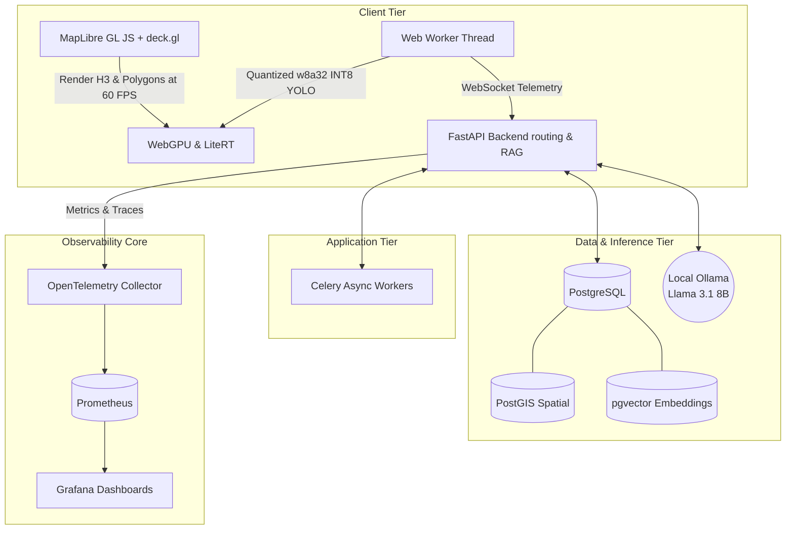

## Scalable Cloud Deployment Options

While CropPilot is heavily optimized to run on consumer hardware for local data sovereignty, the fully containerized microservices architecture allows it to be seamlessly lifted and shifted to major cloud providers for minimal operational costs.

* **Amazon Web Services (AWS)**: Deploy the Next.js and FastAPI containers to Amazon ECS with Fargate for serverless compute. Migrate the database to Amazon RDS for PostgreSQL (with PostGIS/pgvector extensions natively supported). The Ollama inference engine can be hosted on affordable EC2 g4dn instances.
* **Google Cloud Platform (GCP)**: The stateless frontend and backend can be deployed entirely to Google Cloud Run for zero-to-scale cost efficiency. The database seamlessly maps to Cloud SQL for PostgreSQL.
* **Microsoft Azure**: Deploy containers to Azure Container Apps and migrate the database to Azure Database for PostgreSQL Flexible Server.

This extreme portability ensures you can start locally for free and effortlessly scale to the cloud as production demands increase, entirely avoiding vendor lock-in.

## Local Hardware Prerequisites

CropPilot is optimized to run a full LLM and telemetry stack simultaneously on consumer gaming hardware.
* **GPU**: NVIDIA RTX 4060 (8GB VRAM minimum for quantized Llama 3.1).
* **Memory**: 32GB RAM (Required to share load between PostgreSQL shared buffers, system memory, and Docker overhead).
* **OS**: Windows (WSL2), Linux, or macOS.

## Quick Start Setup Guide

Follow these steps to deploy the entire Edge-Hybrid stack locally with zero cost.

### 1. NVIDIA Container Toolkit Setup
Ensure you have Docker Desktop installed and running. On Linux or WSL2, install the NVIDIA Container Toolkit to pass your RTX 4060 through to the Ollama container.

### 2. Boot the Infrastructure Mesh
Spin up the unified PostgreSQL database, Celery workers, API, and the Observability Core:
```bash
docker-compose up -d --build
```

### 3. Pull the Local LLM Model
Execute into the Ollama container and pull the Llama 3.1 8B model into local VRAM:
```bash
docker exec -it croppilot-main-ollama-1 ollama run llama3.1:8b
```

### 4. Launch the Frontend Application
In a separate terminal, install dependencies and boot the Next.js development server:
```bash
cd frontend
npm install
npm run dev
```

### 5. Start the Telemetry Simulator
To generate live traffic for Grafana metrics, run the Node.js traffic simulator:
```bash
node scripts/simulate_traffic.js
```
Visit http://localhost:3000 to access the Agri-Command Center, and your mapped port (e.g., http://localhost:3001) to view the Grafana observability panels.

## Application Screenshots

| Dashboard Views |
| :---: |
| 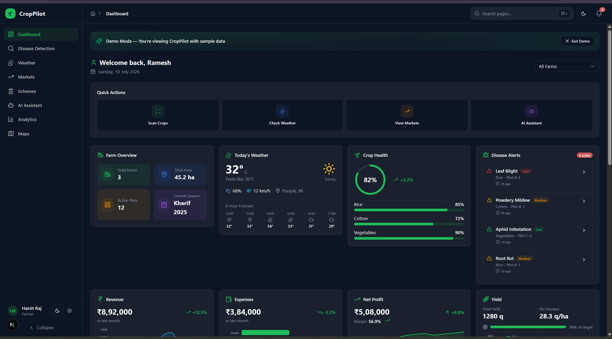 |
| 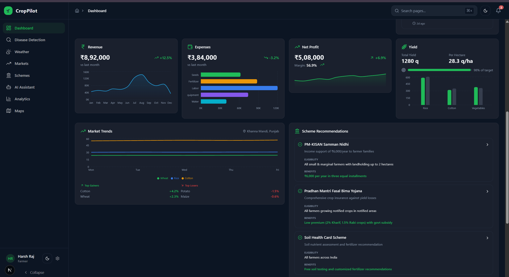 |
| 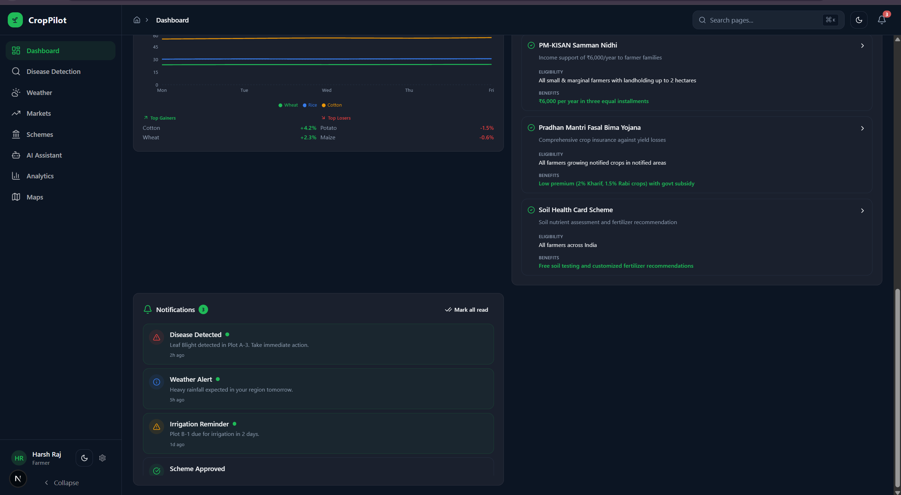 |
| 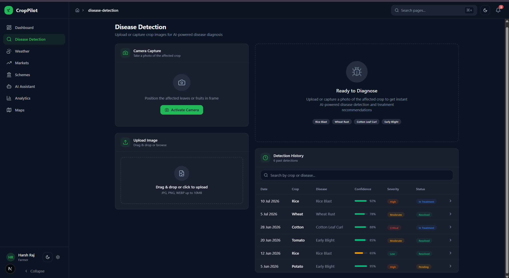 |
| 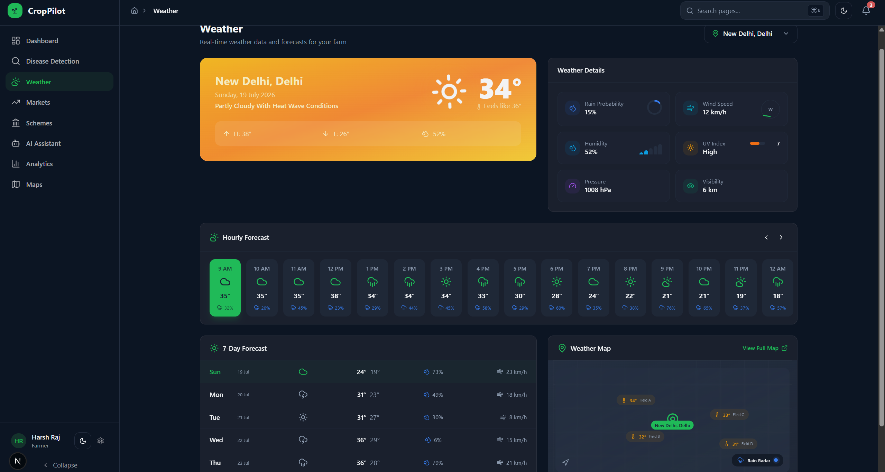 |
| 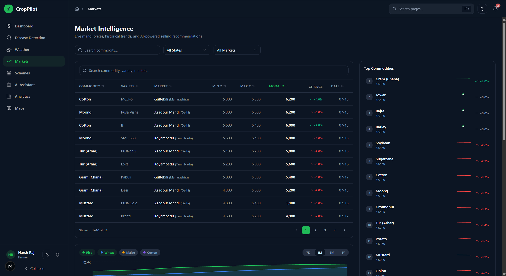 |
| 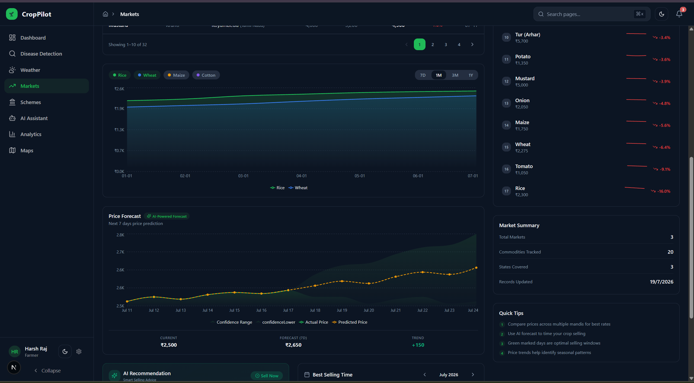 |
| 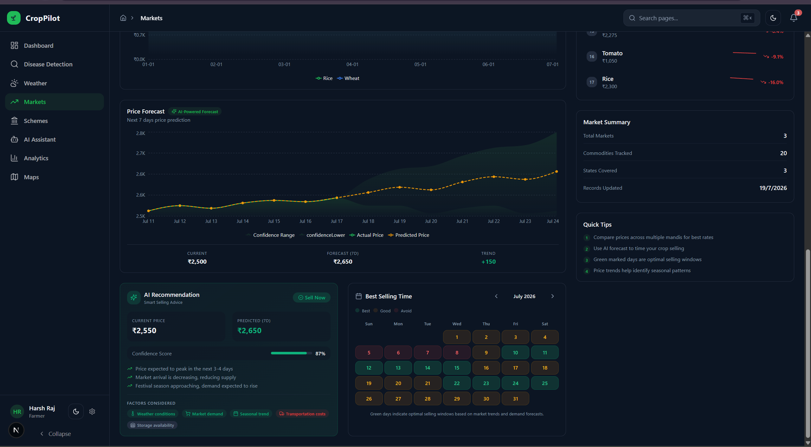 |
| 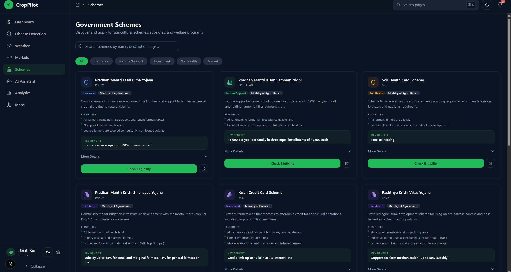 |
| 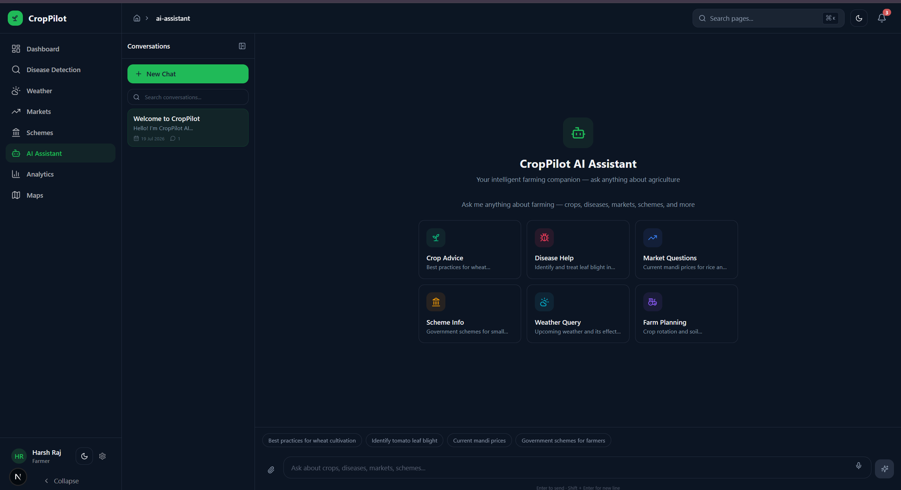 |
| 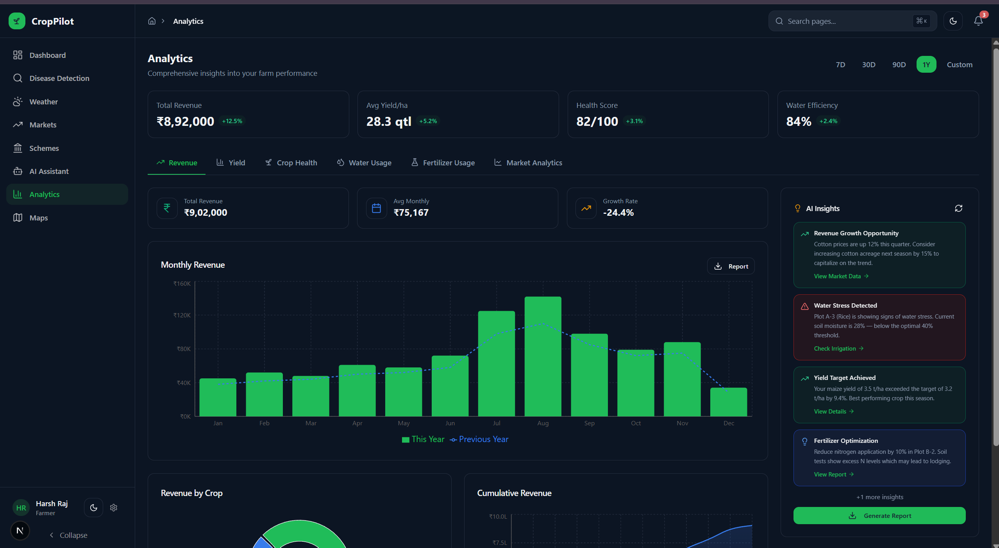 |
| 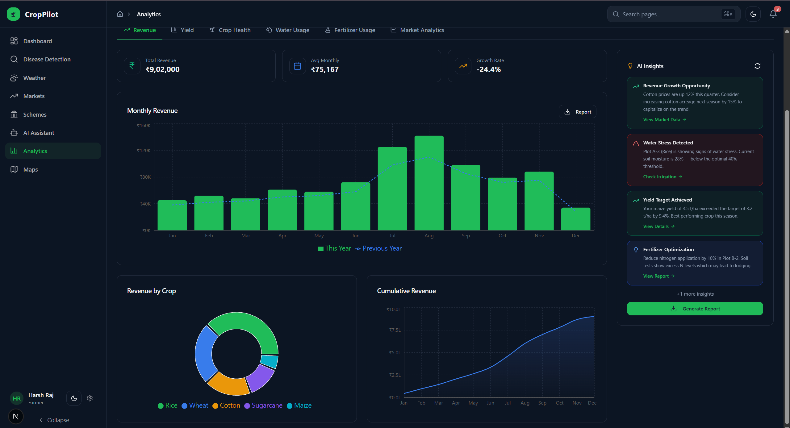 |
