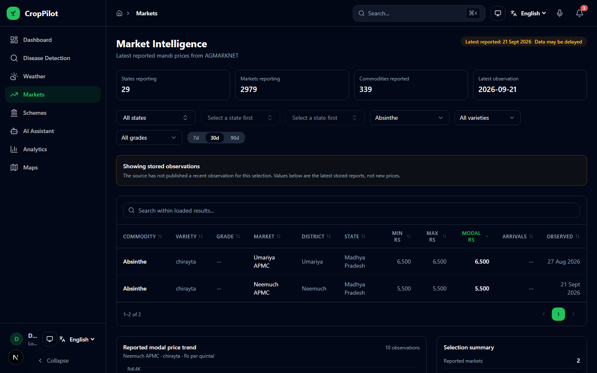
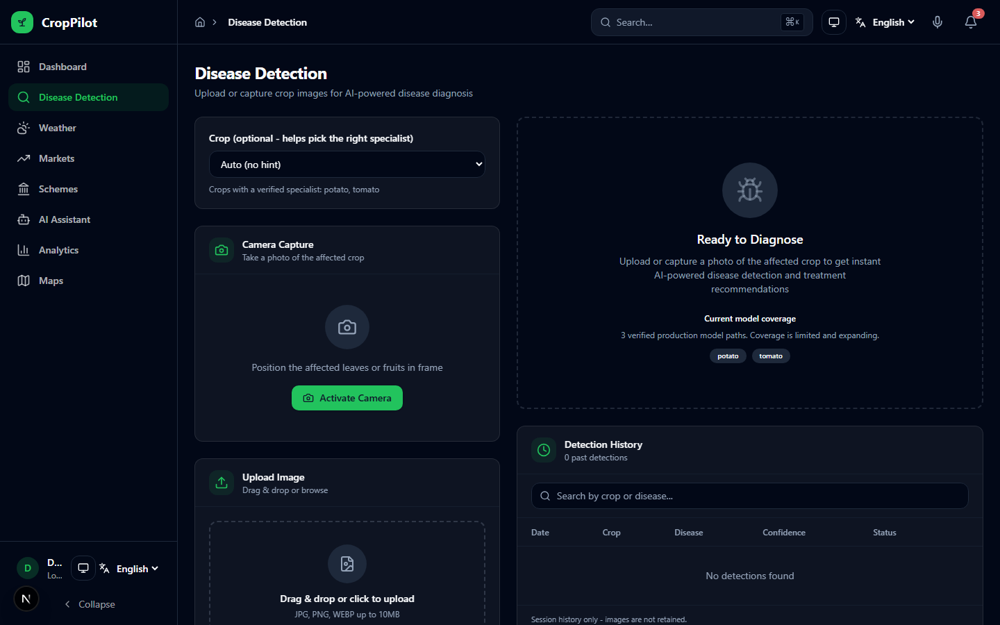
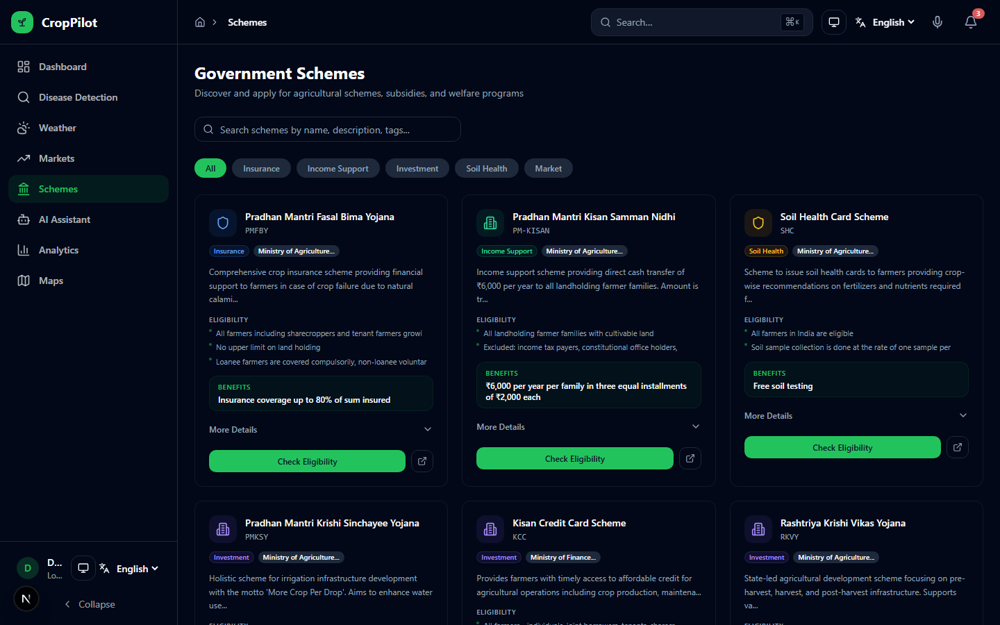
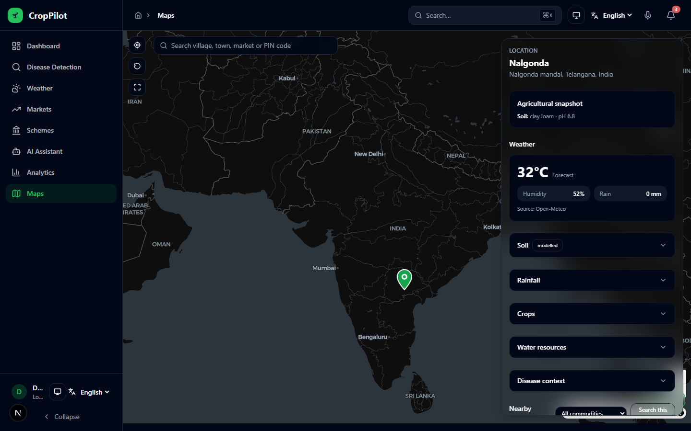
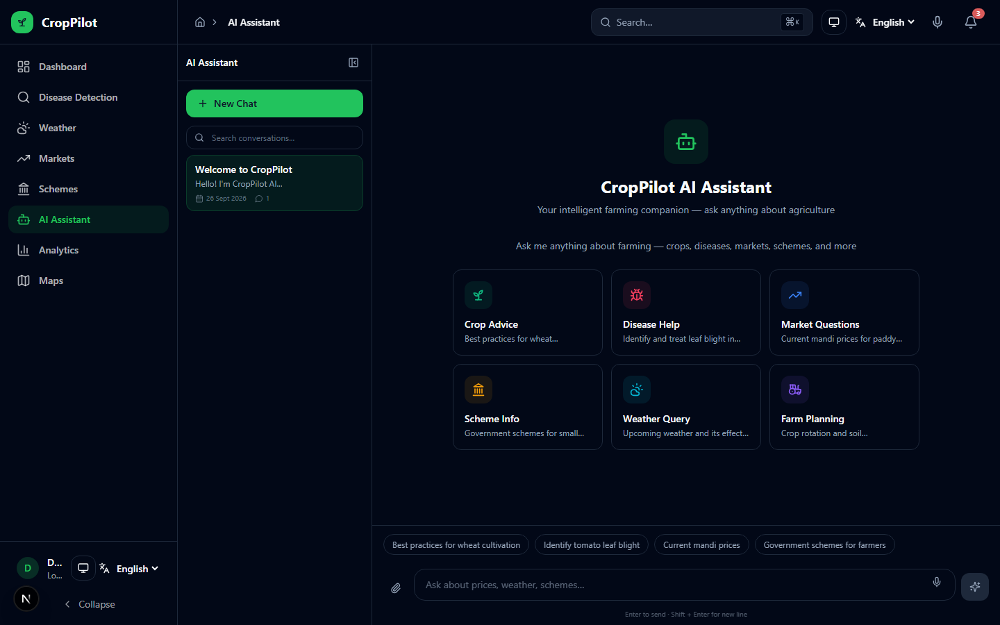
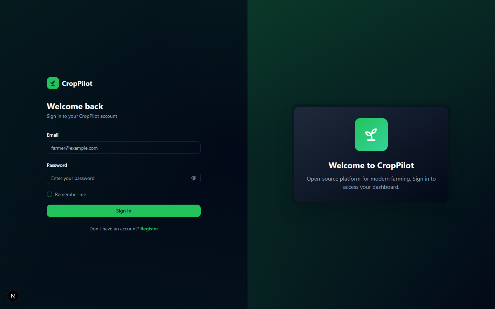
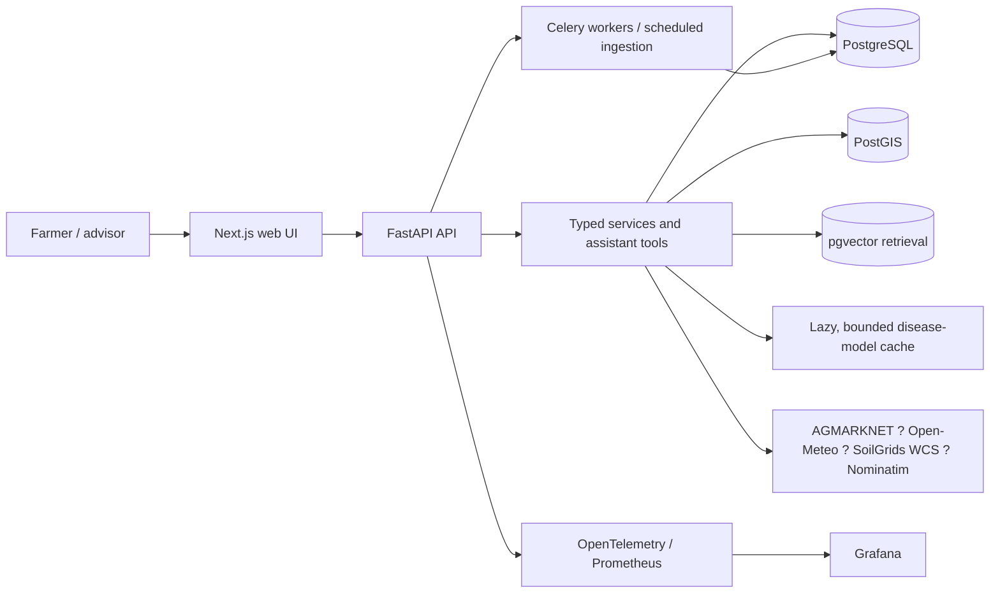

# CropPilot

**By Team Los FOSS**

**Agricultural information workspace for Indian farmers and agricultural users.** CropPilot brings reported mandi prices, weather, location context, disease analysis, government-scheme information and an AI assistant into one web application.

> CropPilot is an existing project that has been developed over time; it was not created from scratch for Open Build Week. This release pass documents the actual product and its current limits.

## Why CropPilot?

Agricultural decisions draw on information spread across market bulletins, weather services, local context and government programs. CropPilot puts those workflows together so a user can look up a location or commodity, review source-dated information, and ask follow-up questions without confusing estimates with observations.

**For:** farmers, agricultural advisors and people supporting farm decisions in India.

## What you can do

- **Market Intelligence:** search AGMARKNET-backed mandi observations by state, district, market, commodity and variety. Prices are *latest reported* observations with arrival dates, not guaranteed live prices.
- **Weather:** view current conditions and forecasts from Open-Meteo, with source and observation/fetch timing.
- **Agricultural Map:** search/select locations, see mapped markets and their reported observations, weather/rainfall context, partial SoilGrids properties, market-trade crop context and crop-associated disease context. Unavailable sources remain explicitly unavailable.
- **Disease Detection:** upload a crop image for deterministic image-quality checks and eligible specialist-model inference. Weak evidence, unsupported crops and model errors are separate outcomes. Raw scores are not calibrated probabilities; verified production coverage is limited and no model is field-validated.
- **Government Schemes:** browse available scheme information and follow source links.
- **AI Assistant:** ask agricultural questions through the existing LangGraph agent, typed tools and retrieval/citation pipeline. Provider routing includes local Ollama and optional configured hosted providers; paid providers are not mandatory.
- **Voice:** server-side ASR/TTS adapters are available for a narrower language set than the UI catalogs. See [voice documentation](docs/assistant-voice.md); UI-language availability does not imply ASR/TTS support.

## Screenshots

Screenshots are captured from the running application and reviewed before publication. They show real data where available and honest unavailable states otherwise.

| Market Intelligence | Disease Detection |
|---|---|
|  |  |

| Government Schemes | Agricultural Map |
|---|---|
|  |  |

| AI Assistant | Login |
|---|---|
|  |  |

See [screenshot inventory](docs/screenshots/README.md) for route, viewport, language and notes.

## Architecture


```mermaid
flowchart LR
  U[Farmer / advisor] --> FE[Next.js web UI]
  FE --> API[FastAPI API]
  API --> SVC[Typed services and assistant tools]
  SVC --> DB[(PostgreSQL)]
  SVC --> GEO[(PostGIS)]
  SVC --> VEC[(pgvector retrieval)]
  API --> Q[Celery workers / scheduled ingestion]
  Q --> DB
  SVC --> MODELS[Lazy, bounded disease-model cache]
  SVC --> EXT[AGMARKNET ? Open-Meteo ? SoilGrids WCS ? Nominatim]
  API --> OBS[OpenTelemetry / Prometheus]
  OBS --> G[Grafana]
```

This diagram describes the current containerized architecture at a high level. See [architecture diagrams](docs/architecture/) for data flow, assistant, disease, agricultural data and future scalability views.

## How the data is used

| Source | Current use | Important limit |
|---|---|---|
| AGMARKNET | Mandi observations ingested into CropPilot Market Intelligence and latest reported prices on the map | Reported/delayed observations; coverage/backfill varies; not live prices |
| Open-Meteo | Weather and forecast; rainfall context uses archive/reanalysis plus forecast endpoint | Modelled/reanalysis estimate, not IMD station-observed rainfall |
| SoilGrids / ISRIC | Selected-location soil properties via WCS 2.0.1, cached by spatial cell | 250 m modelled estimates; coverage/provider availability varies; not a farm soil test |
| OpenStreetMap Nominatim | Server-side location search/reverse geocoding and market-coordinate resolution | Rate-limited, cached, and some market coordinates remain unmapped |
| CARTO | Documented keyless MapLibre basemap styles with attribution | Basemap only; does not supply CropPilot agricultural observations |
| CropPilot disease taxonomy/knowledge | Crop-associated disease context and retrieved guidance | Not a local outbreak feed or epidemiological prevalence data |

**Not integrated at this revision:** IMD district rainfall API, CGWB groundwater observations, CWC reservoir bulletins and OGD/DES district crop statistics. The map reports these sections unavailable rather than substituting invented values. OGD access also needs a server-side `DATA_GOV_API_KEY`, not configured here. Full source details and access limitations are in [map data sources](docs/map-data-sources.md).

### Crop-context semantics

The map derives ?commonly traded in nearby district mandis? from AGMARKNET arrivals. This is a market-trade proxy, not an official farm survey or district crop-area statistic. Suitability, where inputs are sufficient, is a rule-based environmental estimate with explicit limitations?not a ?best crop?, yield or profitability prediction. Disease context lists taxonomy-associated risks for those crops, not confirmed local outbreaks.

## AI and disease-model architecture

The assistant uses a LangGraph agent, provider routing, typed tools and the existing RAG/citation pipeline. Disease inference is separate: image quality gate ? routing ? eligible specialists ? bounded inference ? evidence fusion/uncertainty ? optional configured vision fallback and sourced knowledge. DINOv2 is representation/router infrastructure, not a disease classifier. PlantVillage-derived and tomato specialists are not field-validated; no India-validated or field-validated model is currently verified. See [runtime model registry](docs/disease-model-runtime.md) and [disease architecture](docs/disease-detection-architecture.md).

## Multilingual support

The canonical language registry contains 23 locale identifiers, but **11 UI message catalogs are currently present and validated**: English, Telugu, Hindi, Tamil, Bengali, Marathi, Gujarati, Nepali, Punjabi, Sanskrit and Urdu. The selector exposes only catalogs actually available. The remaining 12 canonical locales are not yet translated UI catalogs and are not presented as supported UI languages. Some may have backend voice capability; voice capability is separate and documented in [assistant voice](docs/assistant-voice.md).

Validation command: `cd frontend && npm run i18n:validate`.

## Current architecture and future scalability

**Implemented now:** Docker Compose services; FastAPI; PostgreSQL with PostGIS and pgvector; Celery worker/beat; bounded/lazy model loading; provider/service abstractions; source-aware ingestion and cache layers; OpenTelemetry/Prometheus/Grafana instrumentation.

**Possible future deployment?not currently deployed:** place the Next.js frontend behind a CDN; run multiple containerized API replicas behind a load balancer; move PostgreSQL/PostGIS/pgvector to a managed compatible service with backups/replicas; isolate Celery queues and scale CPU/GPU inference workers separately; add regional cache/ingestion partitions as coverage grows. AWS, Azure, GCP or another container platform could host compatible components, but no multi-cloud deployment or autoscaling cluster is claimed here. See [scalability architecture](docs/architecture/scalability-architecture.md).

## Technology

- **Frontend:** Next.js, React, TypeScript, Tailwind CSS, MapLibre GL, React Query, Playwright.
- **Backend:** Python, FastAPI, SQLAlchemy, LangGraph, Celery.
- **Data:** PostgreSQL, PostGIS, pgvector; AGMARKNET ingestion; Open-Meteo; SoilGrids WCS.
- **AI/ML:** configurable local/hosted provider router, RAG, lazy model adapters, ONNX/PyTorch where available.
- **Observability:** OpenTelemetry, Prometheus and Grafana in the local stack.

## Local development

Prerequisites: Docker Desktop, Node.js/npm and Python matching the backend project configuration.

```powershell
# From repository root
Copy-Item backend/.env.example backend/.env
# Add any required server-side credentials to backend/.env; never put them in frontend config.
docker compose up -d --build

# In another terminal
cd frontend
npm ci
npm run dev
```

Open `http://127.0.0.1:3000`. The API is `http://127.0.0.1:8000`; PostgreSQL is published on host port `5434` (container port 5432); Grafana is `http://127.0.0.1:3001` when enabled. Frontend is not Dockerized. Configure `NEXT_PUBLIC_API_URL` for the frontend environment as needed. Local development auth bypass is development-only; never enable it in production.

Useful checks:

```powershell
cd backend
python -m pytest -q
python -m services.disease validate
python -m services.disease coverage

cd ..\frontend
npm run i18n:validate
npm run i18n:audit
npm run typecheck
npm run build
npx playwright test e2e/map.spec.ts e2e/disease.spec.ts
```

See [demo checklist](docs/demo-checklist.md) for a short walkthrough and known fallback states.

## Repository structure

```text
frontend/       Next.js application, UI, message catalogs, Playwright tests
backend/        FastAPI, services, typed models, ingestion and tests
docs/           Architecture, data provenance, models, voice and demo docs
```

## Open Build Week work

CropPilot predates Open Build Week; the repository is not a greenfield hackathon project. Work delivered during the eligible development period should be described with verifiable commits/dates by the submitting team. This repository?s implemented systems include Market Intelligence, agricultural maps, disease-model infrastructure, multilingual UI, assistant/voice capabilities, data provenance and automated tests; verify the specific eligible-period contribution before submission.

## Limitations

- Only 11 of 23 canonical locale IDs have UI catalogs today; the other locales are not claimed as translated.
- Disease-model coverage is intentionally limited; no verified field/India validation or calibrated probability is available.
- Mandi prices are latest reported AGMARKNET observations, not guaranteed live prices.
- Soil properties are partial SoilGrids model estimates; IMD, CGWB, CWC and OGD/DES are not integrated at this revision.
- Rainfall is Open-Meteo reanalysis/forecast estimate, not IMD station observation.
- Market coordinate coverage is partial; unmapped markets are not assigned invented coordinates.
- Assistant provider availability depends on local configuration; hosted providers are optional, not required.

## License and attribution

See [`LICENSE`](LICENSE). CropPilot uses and attributes third-party open-source libraries, datasets and services under their respective terms. See [map data-source notes](docs/map-data-sources.md) and model registry for source-specific licenses and limitations. CARTO, OpenStreetMap/Nominatim, ISRIC/SoilGrids, AGMARKNET and Open-Meteo are not CropPilot-created services or datasets.
