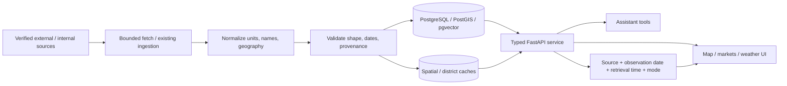

# Agricultural data pipeline

## Sources currently used

- AGMARKNET-backed CropPilot market records (reported mandi observations).
- Existing Open-Meteo weather provider; rainfall history is a modelled
  reanalysis estimate, not IMD station observations.
- SoilGrids v2.0 WCS for partial modelled soil-property estimates.
- Nominatim/OpenStreetMap for geocoding and verified market coordinates.
- CropPilot disease taxonomy/knowledge for crop-associated context.

## Not currently integrated

CGWB groundwater, CWC reservoir bulletins, IMD station rainfall and
DES/OGD district crop statistics are not machine-accessible/configured in
this deployment. These return unavailable status. See
`docs/map-data-sources.md` for access checks, licensing, granularity and
limitations.
