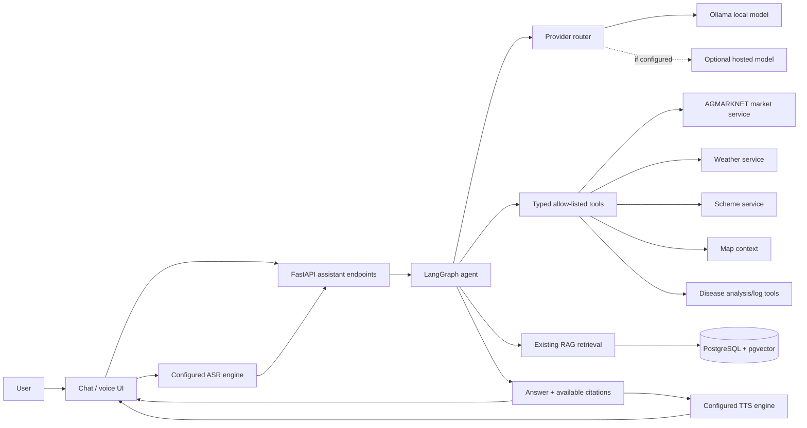

# AI assistant and disease-analysis architecture

## Assistant

The model does not receive arbitrary SQL or execute arbitrary code. Tools
are typed and registered in the existing agent. Provider credentials stay
server-side. Hosted inference is optional; provider/model availability
depends on deployment configuration. Text UI translation does not imply
ASR or TTS support for that locale; consult `docs/assistant-voice.md` for
the actual engine matrix.

## Disease image analysis

```mermaid
flowchart LR
  Image[Uploaded image] --> QA[Decode + deterministic quality gate]
  QA -->|usable| Region[Full image + deterministic crops]
  QA -->|poor| Retake[Insufficient image / retake guidance]
  Region --> Route[Registry/crop-aware routing]
  DINO[DINOv2 representation only] -. routing infrastructure .-> Route
  Route --> Cache[Bounded lazy model cache]
  Cache --> Specialists[Eligible crop specialists]
  Specialists --> Runner[Bounded parallel inference]
  Runner --> Fusion[Evidence-aware fusion]
  Fusion --> Uncertainty[Calibrated only if artifact exists;
  otherwise raw score + uncertainty]
  Uncertainty -->|sufficient evidence| Result[Likely/probable finding]
  Uncertainty -->|weak / unsupported / failure| Honest[Honest uncertainty or error]
  Result --> Knowledge[Verified disease knowledge retrieval]
  Honest --> Knowledge
  Knowledge --> UI[Farmer-friendly result + provenance]
```

DINOv2 is a representation/router component, not a disease detector. The
production registry is limited; models have no field/India validation.
Classifier labels do not prove crop identity. See
`docs/disease-model-runtime.md` and `docs/disease-detection-architecture.md`.
