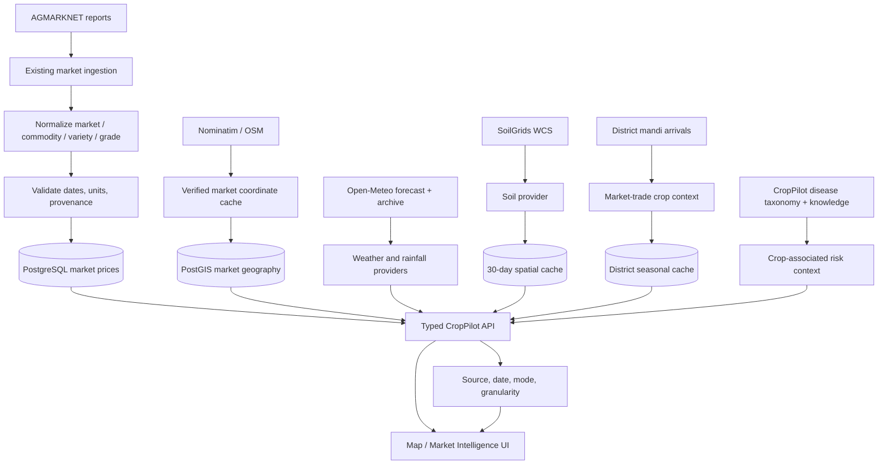

# Agricultural data flow

## Semantics and provenance

| Dataset | Current meaning | Granularity / freshness |
|---|---|---|
| AGMARKNET | Latest **reported** mandi observation; market trade mix is not a farm survey | Market / arrival date; ingestion cadence |
| Open-Meteo weather | Forecast/model output from existing provider | Selected coordinate / provider timestamp |
| Open-Meteo rainfall | Reanalysis + forecast estimate; day gaps remain null and coverage is shown | Selected coordinate / daily window |
| SoilGrids | Modelled soil-property estimates, not a lab test | 250 m product; sampled WCS cell; 30-day cache |
| Crop context | Commodities recently traded in district mandis, not verified district sown area | District / trailing 12 months; 7-day cache |
| Suitability | Rule-based environmental estimate only when required inputs/coverage exist | Derived at selected location; no weighted score |
| Disease context | Taxonomy associations for market-context crops, not local prevalence/outbreaks | Crop / disease taxonomy |

CGWB, CWC, IMD and DES/OGD are listed as unavailable in
`GET /api/v1/map/data-sources`; no values are synthesized for them.

The API aggregates providers with independent failure handling. A provider
timeout yields an unavailable section, while other available sections and
the map continue to work.
