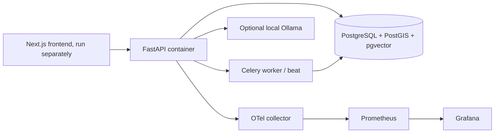
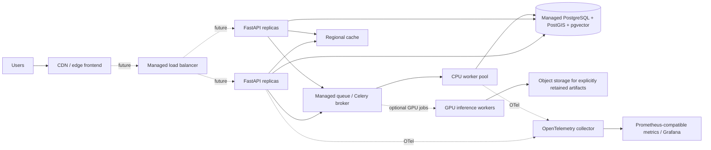

# Scalability and multi-cloud evolution

This document separates the current local Compose setup from a possible
future distributed deployment. Dashed connections in the diagram are
future options, not services currently deployed.

## Current implementation

Current scaling primitives include containerized API/workers, typed service
boundaries, PostgreSQL/PostGIS indexes, pgvector, bounded/lazy model loading,
provider routing, caching, background jobs and observability. No measured
multi-region throughput or autoscaling claim is made.

## Future multi-cloud option (not implemented)

The same containerized FastAPI/Celery interfaces could be deployed on AWS,
Azure, Google Cloud or compatible infrastructure. Database, object storage,
queue, cache, CDN, container platform and observability exporters would need
provider-specific adapters/configuration. Vendor portability is a design
goal, not a claim that the current system is deployed across clouds.

## Growth path

1. **Small:** current single-host Compose; local PostgreSQL and bounded workers.
2. **Medium:** managed PostgreSQL/PostGIS, separate API replicas, external
   cache/queue and worker concurrency limits.
3. **Large:** partition high-volume observations by geography/time where
   measured query patterns justify it; regional ingestion/cache; dedicated
   CPU/GPU inference workers; CDN for frontend/static assets.
4. **Multi-region:** regional read/query services and data replication only
   after data-residency, freshness and consistency requirements are defined.

PostGIS supports geographic filters and indexes. Existing services already
bound market/map requests and cache slowly changing soil/district context;
future scaling must retain provider rate limits, provenance, model license
gates and honest unavailable states. No cloud cost, capacity or availability
SLA is asserted here.
