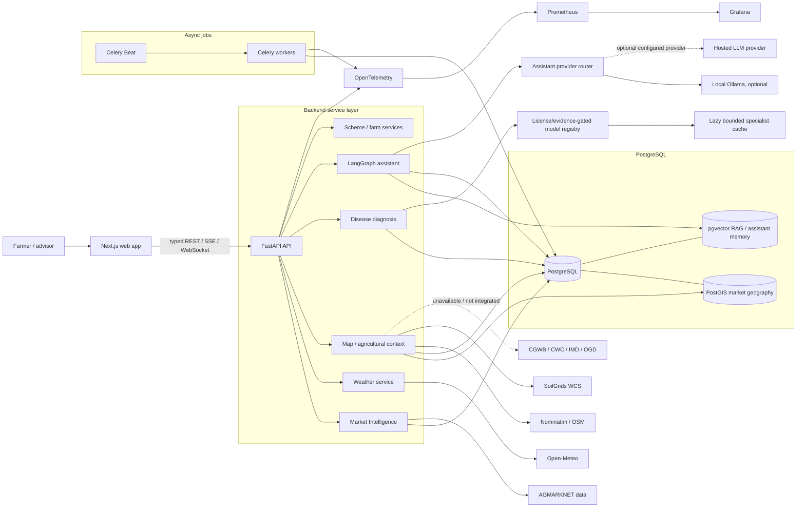

# CropPilot system architecture

This diagram describes the current local/development architecture, not a
multi-cloud production deployment. The frontend is run separately; the
Docker Compose stack runs the API, database, workers and observability.

## Current implementation boundaries

- PostgreSQL is the operational database. PostGIS stores verified market
  coordinates and supports geographic queries; pgvector backs assistant/RAG
  retrieval.
- Market, weather, map, disease, scheme and assistant capabilities remain
  separate backend services behind typed API routes.
- Celery worker/beat handle asynchronous jobs; model artifacts are loaded
  lazily and cached, not loaded wholesale at API startup.
- Optional hosted assistant providers are operator-configured; local Ollama
  can be used. A paid hosted model is not a required product dependency.
- SoilGrids WCS is queried server-side and cached. CGWB groundwater, CWC
  reservoir storage, IMD station rainfall and OGD crop statistics are not
  integrated in the current environment; their UI sections report unavailable.
- OpenTelemetry/Prometheus/Grafana are in the local Compose stack.

## Future deployment

Containerized API/worker replicas, managed PostgreSQL/PostGIS/pgvector,
object storage, regional caches and autoscaled CPU/GPU inference are future
options. They are not represented as current deployed infrastructure.
